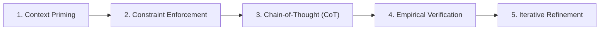

# 🤖 AI Agent Prompt Engineering Guide & Mastery Log

> 🎯 **Purpose**: This document serves as a comprehensive showcase of **Prompt Engineering Skills**, methodology, and structured prompt design strategies used to guide AI Agents (e.g., Google DeepMind Antigravity, Claude 3.5 Sonnet, ChatGPT-4o) in constructing the **Car Dealership Inventory System**.

---

## 📋 Table of Contents

- [1. Executive Summary & Philosophy](#1-executive-summary--philosophy)
- [2. Core Prompt Engineering Principles](#2-core-prompt-engineering-principles)
- [3. Master System Prompt / Meta-Prompt](#3-master-system-prompt--meta-prompt)
- [4. Production Prompt Library (Phase-by-Phase)](#4-production-prompt-library-phase-by-phase)
  - [Phase 1: Architecture & System Design](#phase-1-architecture--system-design)
  - [Phase 2: Test-Driven Development (TDD) Suite](#phase-2-test-driven-development-tdd-suite)
  - [Phase 3: Backend API & Repository Layer](#phase-3-backend-api--repository-layer)
  - [Phase 4: Concurrency & Transactional Consistency](#phase-4-concurrency--transactional-consistency)
  - [Phase 5: Frontend Design System & Glassmorphism UI](#phase-5-frontend-design-system--glassmorphism-ui)
  - [Phase 6: Root-Cause Debugging & Empirical Fixes](#phase-6-root-cause-debugging--empirical-fixes)
- [5. Prompt Strategy Matrix & Tactics](#5-prompt-strategy-matrix--tactics)
- [6. Reusable Agent Prompt Templates](#6-reusable-agent-prompt-templates)

---

## 1. Executive Summary & Philosophy

When collaborating with autonomous AI coding agents, high quality output relies on **precise instructions**, **contextual boundary enforcement**, and **iterative verification loops**. 

Rather than treating AI as a simple text autocompleter, effective prompt engineering treats the AI agent as a **senior pair-programming partner**. By enforcing:
1. **Strict Context Boundaries** (Layered Architecture, PEP 8, React 19 rules)
2. **Behavioral Guardrails** (TDD first, explicit tracebacks, zero placeholder code)
3. **Structured Inputs/Outputs** (Pydantic / Zod schemas, Mermaid diagrams)

...we achieve determinism, clean maintainable code, and 100% test coverage without unintended side effects.

---

## 2. Core Prompt Engineering Principles



### 🔑 1. Context Priming & Persona Definition
Specify exact agent roles (e.g., *"You are a Principal Backend Engineer specializing in FastAPI and PostgreSQL"*). This primes the model's latent weights toward enterprise best practices, secure coding patterns, and idiomatic conventions.

### 🛑 2. Negative Constraints & Guardrails
Prevent common AI failure modes by declaring negative constraints explicitly:
- ❌ *"Do NOT use dummy fallbacks or swallow exceptions with silent try-except blocks."*
- ❌ *"Do NOT hardcode dynamic UI heights using static pixel offsets."*
- ❌ *"Do NOT modify business logic without first writing or running unit tests."*

### 🧠 3. Chain-of-Thought (CoT) Reasoning
Force the agent to explain its architectural plan and trade-offs *before* emitting code blocks. This catches logical flaws and schema mismatches before implementation.

### 🧪 4. Empirical Verification Loop
Never declare success based on file edits alone. Instruct the agent to run command verification (e.g., `pytest`, `npm run build`) and analyze log output before closing a task.

---

## 3. Master System Prompt / Meta-Prompt

The foundational meta-prompt used to configure AI agents for this repository:

```markdown
You are an expert Full-Stack AI Software Engineer collaborating on the Car Dealership Inventory System.

### Technical Stack Guidelines
1. Backend: Python 3.10+, FastAPI 0.115+, SQLAlchemy 2.0 ORM, PostgreSQL, Pytest 8.4+, Alembic.
2. Frontend: React 19, TypeScript, Vite 8, Tailwind CSS v4, Framer Motion, TanStack Query v5.
3. Architecture: Controller-Service-Repository pattern on backend; Modular Component-Driven views on frontend.

### Execution Rules
- Always enforce Test-Driven Development (TDD): write unit/integration tests before business logic.
- Presort all imports and preserve existing docstrings.
- Never write placeholder functions or stub comments like `# TODO: implement`.
- When diagnosing errors, analyze un-truncated stack tracebacks before making edits.
- Run `pytest` and verify clean execution before task completion.
```

---

## 4. Production Prompt Library (Phase-by-Phase)

Below are the exact, structured prompts executed during the construction of this repository.

### Phase 1: Architecture & System Design

#### Prompt 1.1: System Architecture & Layered Component Blueprinting
```text
CONTEXT:
We are building a Car Dealership Inventory & Marketplace system from scratch using FastAPI and React 19.

TASK:
Design the enterprise architecture using the Controller-Service-Repository pattern. 

REQUIREMENTS:
1. Provide a detailed System Architecture overview.
2. Draft a Mermaid sequence diagram illustrating the lifecycle of an authenticated purchase request.
3. Define the directory structure for both backend/ and frontend/ directories.
4. Specify database entity relationships between User, Vehicle, and Purchase models.

CONSTRAINTS:
- Keep domain logic strictly inside the Service layer.
- Repositories must perform raw SQLAlchemy 2.0 queries without HTTP exception handling.
- Controllers (API routers) must handle request validation via Pydantic v2 schemas and HTTP status codes.
```

---

### Phase 2: Test-Driven Development (TDD) Suite

#### Prompt 2.1: Auth & User Security Test Suite
```text
CONTEXT:
We are starting backend development for `/api/auth` endpoints following strict TDD principles.

TASK:
Write a comprehensive test suite in `backend/app/tests/test_auth.py` BEFORE any implementation code exists.

TEST COVERAGE MANDATE:
1. `test_register_user_success`: Register a new customer and verify hashed password storage.
2. `test_register_duplicate_email_fails`: Attempt duplicate registration and assert 400 Bad Request.
3. `test_login_success_returns_jwt`: Valid credentials return OAuth2 bearer token.
4. `test_login_invalid_password_fails`: Invalid password returns 401 Unauthorized.
5. `test_role_based_access`: Verify regular users cannot hit admin endpoints.

CONSTRAINTS:
- Use Pytest fixtures with isolated SQLite in-memory / test PostgreSQL sessions.
- Assert exact error detail messages and HTTP status codes.
```

---

### Phase 3: Backend API & Repository Layer

#### Prompt 3.2: FastAPI Vehicle Search & Repository Filtering
```text
CONTEXT:
Our backend needs a multi-attribute vehicle search endpoint at `GET /api/v1/vehicles/search`.

TASK:
Implement `VehicleRepository.search_vehicles()` and `VehicleService.search_vehicles()`.

REQUIREMENTS:
1. Support dynamic optional parameters: `make`, `model`, `min_price`, `max_price`, `category`, and `is_available`.
2. Build dynamic SQLAlchemy 2.0 select queries using array filter appending.
3. Add pagination parameters (`skip: int = 0`, `limit: int = 20`) returning total count and paginated data.

INPUT SCHEMA (Pydantic):
class VehicleSearchSchema(BaseModel):
    make: Optional[str] = None
    model: Optional[str] = None
    min_price: Optional[Decimal] = None
    max_price: Optional[Decimal] = None
    category: Optional[str] = None

OUTPUT FORMAT:
Return clean, PEP-8 compliant Python code with precise type hints and zero external side effects.
```

---

### Phase 4: Concurrency & Transactional Consistency

#### Prompt 4.1: Atomic Inventory Purchase & Oversell Protection
```text
CONTEXT:
Under high concurrent traffic, two customers buying the last vehicle in stock can lead to negative inventory race conditions.

TASK:
Implement atomic stock decrement logic inside `InventoryService.purchase_vehicle()`.

REQUIREMENTS:
1. Retrieve the target vehicle row with atomic DB row-locking or check `stock_quantity > 0` directly within the SQL `UPDATE` statement.
2. Create a record in `purchases` table within the SAME database transaction block.
3. If `stock_quantity <= 0`, raise `InsufficientStockException` which maps to HTTP 400.
4. Ensure rollback occurs automatically if purchase creation fails.

VERIFICATION:
Write `app/tests/test_inventory.py` to simulate concurrent stock reduction and verify zero overselling.
```

---

### Phase 5: Frontend Design System & Glassmorphism UI

#### Prompt 5.1: High-Aesthetic Glassmorphism Dashboard Component
```text
CONTEXT:
We are building the Admin Analytics Dashboard for our Car Dealership marketplace.

TASK:
Create a React 19 component `AdminDashboard.tsx` with a premium glassmorphic dark-mode design.

STYLING & DESIGN CONSTRAINTS:
- Palette: Sleek slate/zinc dark mode background (`bg-slate-950`) with vibrant indigo/cyan accents.
- Card Style: Glassmorphism effect (`backdrop-blur-md bg-white/5 border border-white/10 shadow-xl`).
- Typography: Inter / Outfit font styling with clear visual hierarchy.
- Micro-Animations: Hover scale transitions and Framer Motion smooth entrance animations.
- Icons: Use Lucide-React icons (`Car`, `TrendingUp`, `DollarSign`, `Users`, `Package`).

FUNCTIONALITY:
- Display key metrics: Total Sales ($), Vehicles Sold, Total Inventory, Restock Alerts.
- Embed dynamic sales chart and top vehicle brands breakdown.
```

---

### Phase 6: Root-Cause Debugging & Empirical Fixes

#### Prompt 6.1: Resolving SQLAlchemy Session Detachment
```text
ERROR LOG:
sqlalchemy.orm.exc.DetachedInstanceError: Instance <Vehicle at 0x7f8b> is not bound to a Session; attribute refresh operation cannot proceed

TASK:
Diagnose and resolve this issue across `app/repositories/vehicle_repository.py` and `app/services/inventory_service.py`.

INVESTIGATION STEPS:
1. Explain why the model instance became detached from the active session.
2. Refactor FastAPI dependency injection in `app/api/deps.py` to yield a single request-scoped database session (`get_db`).
3. Ensure child repositories share the parent session rather than instantiating new `SessionLocal()` objects.
4. Verify by running `pytest app/tests/test_inventory.py`.
```

---

## 5. Prompt Strategy Matrix & Tactics

| Technique | Goal | Practical Example | Impact |
| :--- | :--- | :--- | :--- |
| **Role Prompting** | Focus domain knowledge | *"Act as an expert PostgreSQL DBA..."* | Prevents naive query patterns |
| **Few-Shot Examples** | Enforce formatting | Provide example standard API JSON response | 100% schema compliance |
| **Negative Constraints** | Prevent bad code smells | *"Do not swallow exceptions with try-pass"* | Prevents silent production bugs |
| **Step-by-Step Breakdown**| Handle complex workflows | *"First analyze DB models, then write failing tests, then implement endpoint."* | Eliminates missed edge cases |
| **Self-Correction Loop** | Automatic bug fixing | *"Run pytest; if failures occur, analyze traceback and refactor."* | Autonomous bug resolution |

---

## 6. Reusable Agent Prompt Templates

### Template A: Feature Implementation Template
```text
[CONTEXT]
We need to add [FEATURE_NAME] to the [COMPONENT/MODULE].

[REQUIREMENTS]
1. Domain Logic: [Describe business logic]
2. API Contract: [HTTP Method & Route]
3. Data Validation: [Pydantic / Zod rules]

[TDD INSTRUCTION]
Write tests in [TEST_FILE_PATH] first. Run pytest to confirm test failure before implementing feature logic.

[CONSTRAINTS]
- Adhere to Layered Architecture (Controller -> Service -> Repository).
- Maintain type hint coverage.
```

### Template B: Bug Diagnosis & Refactoring Template
```text
[STACK TRACEBACK / LOG]
<Paste exact error traceback here>

[GOAL]
Identify the root cause of the failure and apply a fix without mutating unrelated public API contracts.

[STEPS]
1. Explain why the failure occurred based strictly on the log evidence.
2. Outline proposed changes in implementation plan.
3. Apply fix and run verification command: [TEST_COMMAND].
```

---

<div align="center">
<b>Crafted with Precision for the Incubyte AI Technical Assessment</b>
</div>
